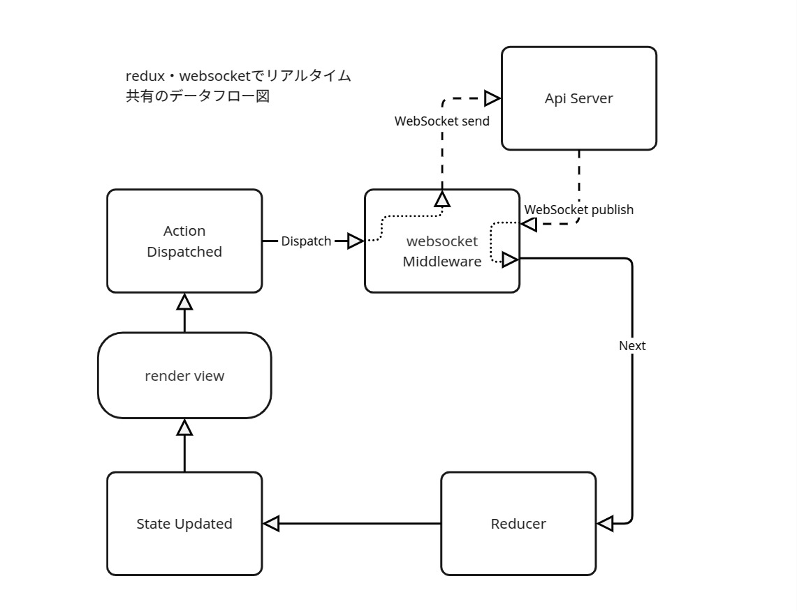

# origin_product

## 報告スパルタン！！

このアプリは警備業における勤怠監視アプリです。

## 目次

- [モチベーション](#モチベーション)
- [機能概要](#機能概要)
- [使用技術](#使用技術)
- [技術選定の理由](#技術選定の理由)
- [インストール方法](#インストール方法)
- [コア機能の概要](#コア機能の概要)

## モチベーション

このアプリを作成した理由は、業務システムに必要な機能が存在しなかったため、自分で作りたかったからです。現在、私は警備会社に勤めており、警備業の勤怠管理は少し特殊です。自宅から勤務地に出発した時、現場に到着した時、勤務が開始した時、勤務が終了した時の1勤務に4回の報告を行う慣習があります。もし報告予定時刻までに連絡がなかった場合は本人に連絡を入れる必要がありますが、現状その管理に不備があり、未報告が原因で会社の信用に関わる問題が発生しました。そのため、時刻のアラート機能を実装することで、誰が未報告か簡単に把握でき、勤務実績を正確にすることで給与計算の不備をなくすことを目標として作成しました。

## 機能概要

このアプリは主に4つの機能を実装しています。

1. 業務管理システムから出力された勤務予定のCSVファイルをDBに格納する機能
2. DBに格納された勤務予定レコードを監視してアラートを発報する機能
3. WebSocketを使用してリアルタイムに報告データを共有する機能
4. 業務管理システムへ報告（打刻）データを含んだCSVを出力する機能

## 使用技術

### フロントエンド

- React
- TypeScript
- Redux Thunk
- Recoil
- Shadcnui
- Motion（アニメーションライブラリ）
- TailwindCSS

### バックエンド

- Go言語
- Echo（Webフレームワーク）
- Gorilla（WebSocketライブラリ）
- Gorm（ORMライブラリ）
- PostgreSQL
- Nginx（Webサーバー）

### インフラ

- Docker（社内イントラネットワークでの小規模な利用のため、Dockerでも十分な性能があると判断）
- Ubuntu Server（社内サーバー）
- AWS（見本用のインフラ）
- Terraform（見本用のAWSの構築に使用）

### その他周辺アプリ

- Python（業務システムに勤怠データを登録するためにRPAを作成）

## 技術選定の理由

今回作成したアプリは、パソコン操作が苦手なご年配の方でも利用しやすいよう、極力シンプルで画面遷移を少なくしたUI/UXを意識したSPAアプリを目指しました。そのため、ReactとTypeScriptでフロントエンドを作成することにしました。また、リアルタイムにサーバーと全ユーザーとのデータ共有を確立したかったので、Reduxのデータフローを参考にRedux ThunkとWebSocketを組み合わせ、ReduxのActionオブジェクトをサーバーで全クライアントに配信する形式を採用しました。このアプリはクライアントの操作をリアルタイムに共有することと、サーバー側で監視した時間タスクをクライアントに送信することがコア機能となります。Railsでは求める機能の具体的な実装に関する情報が少なく、またRailsとライブラリの依存関係の多さからくる不安があったため、Go言語でミニマルに実装することに決めました。Go言語のゴルーチンが持つグリーンスレッドと非同期処理の仕組みにより、コア機能を実装した方が自由度や信頼性の観点で優れていると考えました。

## コア機能の概要

### コア機能のロジック1: 一人の操作のリアルタイム反映

1. 更新ボタン（報告確認が完了した）が押されると、ReduxのディスパッチャーによってActionオブジェクトがReduxミドルウェアに渡されます。
2. ReduxミドルウェアはActionオブジェクトをWebSocketに渡します。
3. WebSocketはActionオブジェクトをサーバーに送信します。
4. サーバーはActionオブジェクトを受信すると、サーバーサイドのキャッシュとDBに登録します。
5. DBに登録されたら、サーバーはWebSocketを通じて全クライアントに登録されたデータを送信します。
6. 全クライアントは受信したデータをReduxのミドルウェアで受け取り、ReducerでStoreを更新します。
7. 全クライアントはReduxのStateが更新されると、画面が更新されます。

### コア機能のロジック2: 時間の管理とアラートの発報

1. テーブルと関連した独自実装のキャッシュを30秒おきに定期実行で監視します。
2. 報告予定時間を表す、監視中のキャッシュデータの中で時間が過ぎたものがあれば、WebSocketを通じて全クライアントにアラートを送信します。
3. 全クライアントは受信したアラートをReduxのミドルウェアで受け取り、ReducerでStoreを更新します。
4. 全クライアントはReduxを含んだカスタムフックでアラート状態のデータを抽出し、アラートを表示・アラート音声を再生します。

## サーバーサイドのロジック

サーバーサイドのロジックはアクター指向プログラミングを参考にしています。イベントループを保持したゴルーチンをFIFOキュー構造のチャネルでやり取りさせることで、データの整合性を保ちつつ、複数のタスクを並行に処理しています。この実装方法はWebSocketを利用したアプリケーションと相性が良いと判断しました。具体的には、DBとの窓口となる構造体（リポジトリパターン）を作成し、その構造体にDBのレコードを保持したキャッシュを持たせました。そのキャッシュを一定の間隔で走査し、時間が過ぎたものを見つけるゴルーチンを走らせました。もしキャッシュ内に該当するレコードがあれば、レコードを模した構造体のアラートフラグをTrueに更新・DBに保存し、チャネル経由でWebSocketを管理しているゴルーチンに送信しました。これにより、全クライアントにデータを配信するフローを実現しました。

## セキュリティ

### イントラネット版（本番環境）

- **SSL**: 社内での利用のため、オレオレ証明書を発行し、NginxでSSL終端処理の設定を行いました。
- **認証**: JWTを使用しクッキーに格納しました。GoのEchoミドルウェアで各種APIエンドポイントにリクエストを渡す前にクッキーを取得し、JWTの検証処理を挟みました。
- **DB保存**: ユーザーのパスワードはハッシュ化して保存するようにしました。

### AWS版（見本用）

- **SSL**: ALBでSSL終端処理を行う設定にしました。したがって、NginxではReactのビルドファイルの配信とAPIサーバーのリバースプロキシの設定を行いました。
